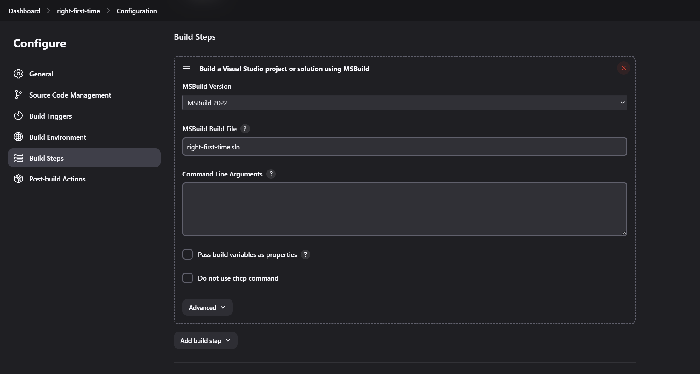

# MSBuild Plugin

 
 
 


The MSBuild plugin allows you to use MSBuild to build .NET and Visual Studio projects within Jenkins.

- [Pipeline Configuration](#pipeline-configuration)
- [Free Style Job Configuration](#free-style-job-configuration)
- [Tools Setup](#tools-setup)
- [Known Issues and Workarounds](#known-issues-and-workarounds)

## Pipeline Configuration

Here's an example Jenkins declarative pipeline script for utilizing the MSBuild plugin:

```groovy
pipeline {
    agent any
    tools {
        msbuild 'MSBuild 2022'
    }
    stages {
        stage('Build') {
            steps {
                script {
                    bat 'msbuild right-first-time.sln /p:Configuration=Release %MSBUILD_ARGS%'
                }
            }
        }
    }
}
```

## Free Style Job Configuration

On your project configuration page, specify the name of the build file (`.proj` or `.sln`) and any [command line arguments](https://docs.microsoft.com/en-us/visualstudio/msbuild/msbuild-command-line-reference?view=vs-2017) you want to pass in. The files are compiled to the directory where Visual Studio would put them as well.



## Tools Setup

To use this plugin, specify the location directory of MSBuild.exe on Jenkins' configuration page. The MSBuild executable is usually situated in a subfolder of `C:\\WINDOWS\\Microsoft.NET\\Framework`. The Visual Studio Build Tools 2022 version of "msbuild.exe" is located in `"C:\\Program Files (x86)\\Microsoft Visual Studio\\2022\\BuildTools\\MSBuild\\Current\\Bin\\"`. If you have multiple MSBuild versions installed, you can configure multiple executables.


## Known Issues and Workarounds

### Troubleshooting

- When using Command Line Arguments, bear in mind that special characters are treated like in Unix, so they will need to be escaped using the backslash.

### Process Stall when using Multicore Builds

- Using the option `/nr:false` (node reuse=false) ensures that the spawned build processes are terminated as soon as the parent process completes, which resolves the issue of build stalls. Since the plugin waits for all spawned processes to finish, this option should be considered implicit. [JENKINS-56234](https://issues.jenkins.io/browse/JENKINS-56234).