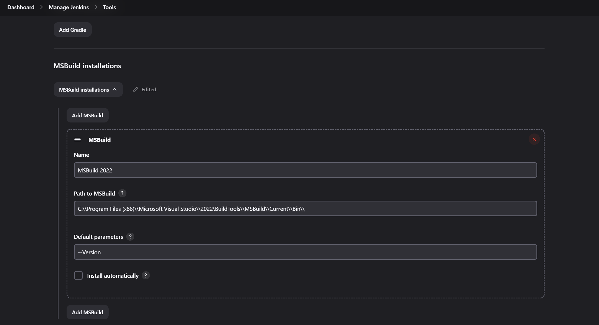

# MSBuild plugin

This plugin allows you to use MSBuild to build .NET and Visual Studio
projects.

## Usage

To use this plugin, specify the location directory of MSBuild.exe on
Jenkin's configuration page. The MSBuild executable is usually
situated in a subfolder of `C:\\WINDOWS\\Microsoft.NET\\Framework`. The
Visual Studio 2017 Community version of "msbuild.exe" is located in
`"C:\\Program Files (x86)\\Microsoft Visual Studio\\2017\\Community\\MSBuild\\15.0\\Bin\\"` If you have multiple
MSBuild versions installed, you can configure multiple executables. 

Then, on your project configuration page, specify the name of the build
file (`.proj` or `.sln`) and any [command line
arguments](https://docs.microsoft.com/en-us/visualstudio/msbuild/msbuild-command-line-reference?view=vs-2017)
you want to pass in. The files are compiled to the directory where
Visual Studio would put them as well.

### Troubleshooting

-   When using Command Line Arguments, bear in mind that special
    characters are treated like in Unix, so they will need to be escaped
    using the backslash.
